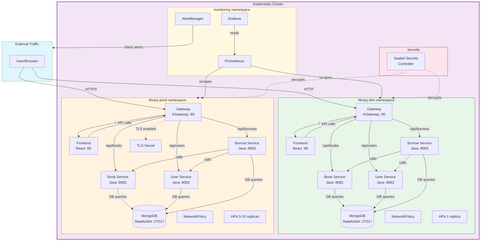
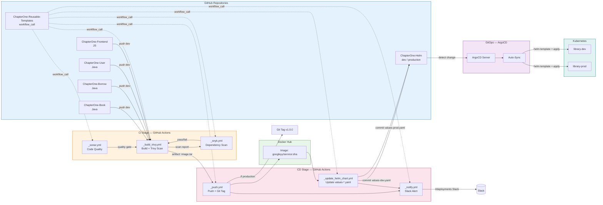

# ChapterOne E2E Platform - DevOps & DevSecOps Presentation Prompt

## Instructions for AI Presentation Generator

Generate a professional, visually stunning PowerPoint-style presentation (or equivalent slide deck) for the **ChapterOne E2E Library Management Platform**. This is a **DevOps, DevSecOps, and GitOps case study presentation** — do NOT focus on application code or business logic. Focus entirely on the infrastructure, CI/CD pipeline, security practices, Kubernetes deployment strategy, and automation workflows.

Target audience: Technical hiring managers, senior engineers, DevOps interviewers, and engineering leaders who want to see end-to-end platform engineering skills.

Use a modern, enterprise-grade visual style. Include architecture diagrams, pipeline flowcharts, and security matrices where appropriate.

---

## Slide Structure & Content Requirements

### Slide 1: Title Slide
- **Title:** "ChapterOne E2E Platform — End-to-End DevOps, DevSecOps & GitOps Implementation"
- **Subtitle:** "Microservices Deployment on Kubernetes with Helm, ArgoCD, and Reusable GitHub Actions"
- **Presenter:** [Your Name]
- **Visual:** Abstract Kubernetes/cluster topology background with overlay text

---

### Slide 2: Project Overview & Scope
- **What this is:** A complete Library Management microservices platform deployed to Kubernetes
- **Architecture style:** Microservices (4 services + frontend + infrastructure)
- **DevOps scope:** Everything from code commit to production deployment
- **Key pillars:**
  - CI/CD with reusable GitHub Actions
  - Container security scanning (DevSecOps)
  - GitOps with ArgoCD
  - Helm-based Kubernetes packaging
  - Multi-environment namespace strategy
  - Network security policies
- **Repos involved:** 7 GitHub repositories under `Googleeyy` org
  - `ChapterOne` (legacy/parent)
  - `ChapterOne-Book`, `ChapterOne-Borrow`, `ChapterOne-User` (Java microservices)
  - `ChapterOne-Frontend` (JavaScript frontend)
  - `ChapterOne-Reusable-Templates` (CI/CD reusable workflows)
  - `ChapterOne-Helm` (Helm charts + ArgoCD + GitOps configuration)

---

### Slide 3: Architecture Overview — The Big Picture
Create a large architecture diagram showing:

**Developer Workflow (Left Side):**
```
Developer pushes code → GitHub PR → Branch Protection Rules → CI Triggers
```

**CI/CD Pipeline (Middle):**
```
Build & Scan (Trivy) → Push to Registry → Update Helm Chart → Notify (Slack)
```

**GitOps & Kubernetes (Right Side):**
```
ChapterOne-Helm Repo (dev/production branches)
  → ArgoCD watches Git
  → Auto-syncs to Kubernetes
  → library-dev namespace (dev)
  → library-prod namespace (production)
```

**Services Deployed:**
- `book-service` (port 8081)
- `user-service` (port 8082)
- `borrow-service` (port 8083)
- `frontend` (port 80)
- `mongodb` (StatefulSet, port 27017)
- `gateway` (KGateway for routing)

**Security & Observability Layer (Bottom/Overlay):**
- **Sealed Secrets Controller** — Encrypts secrets for Git-safe storage, decrypts only in-cluster
- **Prometheus + Grafana** — Metrics collection, service monitoring, cluster health dashboards
- **Network Policies** — Namespace-level traffic segmentation

**Visual:** Use colored zones: Blue for GitHub, Orange for CI/CD, Green for Kubernetes cluster with two namespace bubbles. Purple overlay for security, Yellow overlay for observability/monitoring.

---

### Slide 3a: Application Architecture Diagram — "Inside the Cluster"
Create a clean Mermaid architecture diagram. Use this exact Mermaid code to render:



**Diagram notes for presenter:**
- Two namespaces = complete logical isolation on same cluster
- Gateway API routes traffic by path (`/api/books`, `/api/users`, `/api/borrows`)
- Borrow Service is the orchestrator — calls Book + User Services internally
- MongoDB is a StatefulSet with persistent volume per namespace
- Prometheus scrapes metrics from both environments
- Sealed Secrets controller decrypts Git-committed secrets in-cluster only
- Prod has TLS, HPA (3-10 replicas), and stricter network policies

---

### Slide 3b: CI/CD Pipeline Architecture — "From Commit to Cluster"
Create a horizontal Mermaid flowchart. Use this exact Mermaid code:



**Diagram notes for presenter:**
- 4 microservice repos push to the same reusable workflow hub
- Trivy scans containers for CRITICAL/HIGH vulnerabilities BEFORE push
- Snyk scans Maven/npm dependencies for known CVEs
- SonarQube enforces code quality gates
- Docker Hub stores images tagged with commit SHA
- Production gets an additional `latest` tag + Git tag
- `_update_helm_chart.yml` clones Helm repo, edits `values-*.yaml` with `yq`, commits back
- ArgoCD polls Git every 3 minutes (or webhook) and auto-syncs
- Entire flow: commit → scan → push → update Helm → ArgoCD sync → live pods
- Zero manual `kubectl` or `helm upgrade` commands required

---

### Slide 4: The Microservices Landscape
- **4 Backend Microservices (Java/Spring Boot):**
  - Book Service — inventory management
  - User Service — authentication & user management (JWT-secured)
  - Borrow Service — borrowing records & transactions
- **1 Frontend (JavaScript/React):**
  - Web UI consuming all backend APIs
- **1 Data Layer:**
  - MongoDB StatefulSet with persistent volume (nfs-client StorageClass)
  - 3 databases: `chapterone_books`, `chapterone_users`, `chapterone_borrows`
- **1 Gateway Layer:**
  - KGateway (Gateway API) for ingress routing
  - HTTPRoute definitions for path-based routing (`/api/books`, `/api/users`, `/api/borrows`)
- **Packaging:** Each microservice has its own Helm subchart under `microservices/`
- **Infrastructure charts:** MongoDB and Gateway under `infrastructure/`

---

### Slide 5: Helm Chart Architecture — "Chart of Charts"
- **Pattern:** Umbrella Helm chart (parent chart + subcharts)
- **Parent Chart:** `library-e2e` (Chart.yaml with 6 dependencies)
- **Subcharts:**
  - `microservices/book-service`
  - `microservices/borrow-service`
  - `microservices/user-service`
  - `microservices/frontend`
  - `infrastructure/mongodb`
  - `infrastructure/gateway`
- **Values Hierarchy (highest to lowest priority):**
  1. `values-dev.yaml` / `values-prod.yaml` (environment overrides)
  2. `values.yaml` (parent defaults)
  3. `microservices/*/values.yaml` (subchart defaults)
  4. Subchart internal defaults
- **Key design:** Global namespace propagation — `global.namespace` set at parent level flows to all subcharts
- **Environment files:**
  - `values-dev.yaml` → `library-dev` namespace
  - `values-prod.yaml` → `library-prod` namespace

---

### Slide 6: Environment Strategy — Namespace Separation
Create a comparison table/slide:

| Aspect | Development (library-dev) | Production (library-prod) |
|---|---|---|
| Replicas | 1 per service | 3 per service (HPA 3-10) |
| MongoDB Storage | 1Gi | 10Gi |
| Resource Limits | Low (250m CPU, 256Mi mem) | High (500m CPU, 512Mi mem) |
| Autoscaling | Disabled | Enabled (target CPU 70%, mem 80%) |
| Image Tags | `dev-<commit-sha>` | Semantic (`v1.0.0`) |
| TLS | Disabled | Enabled with TLS secret |
| Network Policies | Optional/Light | Enforced |
| Database Names | `*_dev` suffix | Production names |
| JWT Secret | Weak placeholder | Strong secret (must rotate) |

- **Branch mapping:** `dev` branch → `library-dev` namespace; `production` branch → `library-prod` namespace
- **Isolation:** Complete logical separation at Kubernetes API level within same cluster
- **Chart dependencies:** `helm dependency update` packages all subcharts into `charts/` directory

---

### Slide 7: GitHub Actions — Reusable Workflow Strategy
- **Centralized CI/CD Hub:** `ChapterOne-Reusable-Templates` repository
- **Pattern:** `workflow_call` (reusable workflows callable from any repo)
- **Workflow Inventory:**

| Workflow File | Purpose | Trigger |
|---|---|---|
| `_build_trivy.yml` | Build Docker image + Trivy vulnerability scan | Called by service CI |
| `_push.yml` | Push image to Docker Hub + Git tag (prod) | Called after build |
| `_update_helm_chart.yml` | Update image tag in Helm repo values file | Called after push |
| `_snyk.yml` | Snyk dependency vulnerability scan | Standalone or called |
| `_sonar.yml` | SonarQube code quality analysis | Standalone or called |
| `_notify.yml` | Slack deployment notifications | Final step |
| `ci-example.yml` | Example orchestrator pipeline | Push to dev/production |

- **Benefits:** DRY principle, centralized maintenance, consistent security scanning across all repos
- **Docker Hub:** `googleyy/<service-name>` repository organization

---

### Slide 8: CI/CD Pipeline Deep Dive — The Complete Flow
Create a horizontal pipeline diagram:

**Stage 1: BUILD & SCAN (`_build_trivy.yml`)**
- Runtime setup (Java 21 Temurin / Node 20)
- Build JAR with Maven (`mvn package -DskipTests`)
- Docker build with cache optimization for production
- **Trivy container scan:** `CRITICAL,HIGH` severity threshold
- Upload Docker image as artifact (retention: 1 day)
- Output: `image_full` (registry path + tag)

**Stage 2: PUSH (`_push.yml`)**
- Download artifact + load image
- Push to Docker Hub with commit SHA tag
- Production only: Tag and push `latest`, create Git tag
- Conditional: Only runs if `is_production=true` or `push_dev_images=true`

**Stage 3: UPDATE HELM (`_update_helm_chart.yml`)**
- Checkout `ChapterOne-Helm` repo at correct branch (`dev` or `production`)
- Setup `yq` YAML processor
- Convert kebab-case to camelCase (`book-service` → `bookService`)
- Update `values-dev.yaml` or `values-prod.yaml` with new image tag
- Validate YAML syntax after modification
- Commit as `github-actions[bot]` and push back to branch
- Uses `HELM_REPO_PAT` secret for cross-repo authentication

**Stage 4: NOTIFY (`_notify.yml`)**
- Slack webhook notification with deployment status
- Success/failure summary with environment and service name

---

### Slide 9: DevSecOps — Security Scanning Matrix
Create a security-focused slide with a matrix:

| Security Layer | Tool | What It Scans | Threshold | When It Runs |
|---|---|---|---|---|
| Container Vulnerabilities | Trivy | Docker image OS/packages | CRITICAL, HIGH | Every build |
| Dependency Vulnerabilities | Snyk | Maven/npm dependencies | Configurable (`high`) | Every build or on-demand |
| Code Quality & Bugs | SonarQube | Source code, code smells, coverage | Quality Gate | Every build |
| Network Segmentation | Kubernetes NetworkPolicy | Pod-to-pod traffic | Namespace isolation | Deploy-time |
| Secrets Management | Kubernetes Secrets | JWT, DB credentials | In-cluster only | Deploy-time |

**Trivy Details:**
- Scans built Docker images before push
- Severity filter: `CRITICAL,HIGH`
- Table output + SARIF format for GitHub Security tab
- Optional: `ignoreUnfixed` flag for false positive control

**Snyk Details:**
- Maven projects: `snyk test --severity-threshold=high`
- Node projects: Snyk GitHub Action for Node.js
- Uploads SARIF artifact for audit trail

**SonarQube Details:**
- Java: `mvn verify sonar:sonar` with project key
- Node: SonarSource GitHub Action
- Analyzes code quality, duplication, coverage

---

### Slide 10: GitOps with ArgoCD — "Git as Source of Truth"
Create a GitOps architecture diagram:

**ArgoCD Installation:**
- Helm chart from `argo/argo-cd` repository
- Custom values: NodePort 30080, resource limits for small clusters, Dex disabled
- Namespace: `argocd`

**ArgoCD Configuration:**
- **AppProject:** `library-e2e` defines allowed source repos and destination namespaces
- **App of Apps Pattern:**
  - `library-root` (dev) — watches `argocd-apps/` directory on `dev` branch
  - `library-root-prod` (production) — watches `argocd-apps-prod/` on `production` branch
  - `directory: recurse: true` discovers all Application manifests automatically

**Individual Applications (per service):**
- `book-service`, `borrow-service`, `user-service`, `frontend`
- `mongodb`, `gateway`
- Each has sync-wave annotations for deployment ordering
- `sync-wave: "0"` for microservices
- Higher waves can be used for infrastructure dependencies

**Sync Policy:**
- `automated: prune: true, selfHeal: true`
- `CreateNamespace=true`
- `ServerSideApply=true`
- `revisionHistoryLimit: 3`
- Retry: 3 attempts with exponential backoff (5s → 10s → 20s)

---

### Slide 11: GitOps Flow — Developer to Production
Show a timeline/flow diagram:

**Path 1: Developer Change → Dev Environment**
1. Developer pushes feature branch → merges to `dev` in service repo
2. Service CI triggers → `_build_trivy.yml` → `_push.yml`
3. `_update_helm_chart.yml` updates `values-dev.yaml` in `ChapterOne-Helm:dev`
4. ArgoCD detects commit (polls every 3 min or webhook)
5. ArgoCD runs `helm template` with `values-dev.yaml`
6. Kubernetes applies manifests to `library-dev` namespace
7. New pods roll out (1 replica each, dev image tag)

**Path 2: Promote to Production**
1. Create PR from `dev` → `production` in `ChapterOne-Helm`
2. Merge triggers or manual promotion
3. ArgoCD detects commit on `production` branch
4. Syncs to `library-prod` namespace
5. Production pods roll out (3 replicas, HPA enabled, TLS on)

**Key Principle:** No human runs `helm upgrade` or `kubectl apply` on the cluster. ArgoCD is the ONLY actor touching cluster state.

---

### Slide 12: Kubernetes Network Security — Network Policies
- **Concept:** Kubernetes NetworkPolicy acts as namespace firewall
- **Our Implementation:** Lightweight permissive policy (`templates/network-policy.yaml`)
- **Rules:**
  - ✅ Allow all intra-namespace traffic (microservices talk freely)
  - ✅ Allow DNS resolution (kube-system, TCP/UDP port 53)
  - ✅ Allow MongoDB access (port 27017)
  - ❌ Block all cross-namespace traffic by default
- **Dynamic:** Uses `{{ .Values.global.namespace }}` template variable
  - Dev: applies to `library-dev`
  - Prod: applies to `library-prod`
- **Scope:** All pods in namespace (`podSelector: {}`)
- **Real-world use cases:** Multi-tenant SaaS, microservices segmentation, zero-trust, compliance (SOC2, GDPR)
- **Defense in depth:** NetworkPolicy + Image Scanning + RBAC + Secrets Management + Runtime Security

---

### Slide 12a: Secrets Management with Sealed Secrets — "Git-Safe Secrets"
- **Problem:** Kubernetes Secrets in Git are base64-encoded, NOT encrypted. Anyone with Git access can read them.
- **Solution:** Sealed Secrets (Bitnami) — encrypt secrets for safe storage in Git
- **Architecture:**
  ```
  Developer creates secret locally with kubeseal → SealedSecrets controller in cluster decrypts → Native Kubernetes Secret
  ```
- **Workflow:**
  1. Developer creates standard Kubernetes Secret locally
  2. Run `kubeseal` against cluster's public key → produces `SealedSecret` CRD
  3. Commit `SealedSecret` YAML to Git safely (it's encrypted)
  4. ArgoCD syncs `SealedSecret` to cluster
  5. Sealed Secrets Controller decrypts it → creates native `Secret` in target namespace
- **Production Implementation:**
  - `sealed-secrets-prod/` directory contains production SealedSecrets
  - `sealed-mongodb-secret-prod.yaml` — MongoDB credentials encrypted for `library-prod`
  - Each secret is bound to a specific namespace and cannot be used elsewhere
- **Benefits:**
  - Secrets version-controlled in Git alongside application code
  - No manual secret injection into clusters
  - ArgoCD + GitOps compatible — everything is declarative
  - Namespace-scoped encryption prevents secret leakage across environments
- **Tools:** `kubeseal` CLI, `bitnami-labs/sealed-secrets` controller, `SealedSecret` CRD

---

### Slide 12b: Observability with Prometheus + Grafana
- **Purpose:** Production-grade monitoring, alerting, and visualization for the entire platform
- **Stack Architecture:**
  ```
  Prometheus Server (metrics collection & storage)
    → Grafana (dashboards & visualization)
    → AlertManager (alert routing: Slack, PagerDuty, Email)
  ```
- **Prometheus Components:**
  - **Prometheus Server** — Scrapes metrics from services, nodes, and infrastructure
  - **ServiceMonitor/PodMonitor CRDs** — Auto-discovery of scraping targets in namespaces
  - **Prometheus Rule** — Recording rules and alerting rules (CPU > 80%, memory pressure, pod crash loops)
  - **Persistent Volume** — Retains metrics history (e.g., 15 days)
- **Grafana Components:**
  - **Pre-built Dashboards:** Kubernetes cluster overview, pod resource usage, service latency, MongoDB metrics
  - **Custom Dashboards:** Microservice-specific SLOs, error rates, request throughput
  - **Data Source:** Prometheus as primary metrics backend
  - **Authentication:** OAuth/GitHub SSO integration for team access control
- **Key Metrics Monitored:**
  | Metric | Alert Threshold | Action |
  |---|---|---|
  | Pod CPU Usage | > 80% for 5m | HPA scales up or alert ops |
  | Pod Memory Usage | > 85% for 5m | Alert + investigate leak |
  | Pod Restart Count | > 3 in 10m | Alert + check crash logs |
  | Service Error Rate | > 5% for 2m | PagerDuty/Slack alert |
  | ArgoCD Sync Status | OutOfSync > 10m | Alert — drift detected |
  | MongoDB Connections | > 80% of max | Alert + scale connection pool |
  | Node Disk Pressure | < 10% free | Alert + node cleanup |
- **Deployment:** Prometheus + Grafana deployed as Helm charts into `monitoring` namespace
- **GitOps Integration:** ArgoCD manages Prometheus/Grafana deployments from Git
- **Benefits:** Proactive incident detection, SLO tracking, capacity planning, post-incident analysis

---

### Slide 13: Secrets Management & Configuration (Legacy + Transition Path)
- **Kubernetes Secrets** (not encrypted at rest by default, but in-cluster only)
- **Secrets defined:**
  - `mongodb-secret` (empty/simple URI pattern)
  - `book-service-secret`
  - `user-service-secret` (contains `JWT_SECRET`)
  - `borrow-service-secret`
- **Dev vs Prod differences:**
  - Dev: `JWT_SECRET: "dev-jwt-secret-not-for-production"`
  - Prod: `JWT_SECRET: "CHANGE-THIS-TO-A-SECURE-PRODUCTION-SECRET"`
- **Production hardening recommendations documented:**
  - Use Sealed Secrets (Bitnami)
  - External Secrets Operator with cloud KMS
  - HashiCorp Vault integration
  - Regular secret rotation
- **ConfigMaps:** Each service has its own ConfigMap for non-sensitive configuration
- **MongoDB:** Init script ConfigMap seeds database with 20 sample books on first startup

---

### Slide 15: Branch Protection & Governance
- **Branch Strategy:**
  - `dev` branch: Active development, auto-deploy to dev environment
  - `production` branch: Protected, deploys to production
- **Branch Protection Rules (recommended for production):**
  - Require PR before merging
  - Require 1 approval
  - Dismiss stale approvals on new commits
  - Require status checks (`helm-validate`)
  - Block force pushes
  - Restrict push access to admins
- **Helm Validation Workflow:**
  - Runs on every PR to `dev` and `production`
  - Validates YAML syntax with `yq`
  - Lints all subcharts with `helm lint`
  - Templates dry-run with both `values-dev.yaml` and `values-prod.yaml`
  - Blocks merge if any check fails
- **The CD Bypass:** Automated `_update_helm_chart.yml` pushes directly using PAT — this is intentional for CI/CD but human changes must go through PRs

---

### Slide 16: Monitoring, Operations & Rollback
**Day-2 Operations with ArgoCD:**
- `argocd app list` — view all application statuses
- `argocd app get <app>` — detailed sync status
- `argocd app sync <app>` — manual sync trigger
- `argocd app history <app>` — view deployment history
- `argocd app rollback <app> <revision>` — instant rollback

**Helm Rollback (native):**
- `helm history library-dev -n library-dev`
- `helm rollback library-dev -n library-dev`

**Troubleshooting commands documented:**
- Pod logs, describe, events
- Service endpoints and DNS resolution
- Network policy verification with test pods
- PVC status for MongoDB

**GitOps Advantages for Operations:**
- Complete audit trail in Git (who changed what, when)
- Declarative state — cluster always matches Git
- Self-healing — ArgoCD reverts manual cluster changes
- Pruning — removes resources not in Git

---

### Slide 17: Complete Toolchain & Technologies
Create a technology stack visual:

| Layer | Technology | Purpose |
|---|---|---|
| **Orchestration** | Kubernetes | Container orchestration |
| **Package Manager** | Helm 3 | Kubernetes manifest templating |
| **GitOps** | ArgoCD | Continuous delivery from Git |
| **Gateway** | KGateway (Gateway API) | Ingress & routing |
| **Database** | MongoDB (StatefulSet) | Document storage |
| **Storage** | nfs-client (StorageClass) | Persistent volumes |
| **CI/CD** | GitHub Actions | Build, test, deploy automation |
| **Registry** | Docker Hub | Image storage (`googleyy/*`) |
| **Security Scan** | Trivy | Container vulnerability scanning |
| **Dependency Scan** | Snyk | Dependency vulnerability scanning |
| **Code Quality** | SonarQube | Static analysis |
| **Notifications** | Slack | Deployment alerts |
| **Secret Encryption** | Sealed Secrets (Bitnami) | Git-safe secret encryption |
| **Metrics Collection** | Prometheus | Time-series metrics & alerting |
| **Visualization** | Grafana | Dashboards & observability |
| **Alert Routing** | AlertManager | Alert routing & grouping |
| **YAML Processing** | `yq` | Automated values file editing |
| **Version Control** | Git + GitHub | Source of truth |

---

### Slide 18: Key Achievements & Metrics
- **Multi-repo CI/CD:** 4 microservices + frontend sharing identical reusable workflows
- **Zero manual cluster access:** All deployments via GitOps
- **Security gates:** 3 scanning tools (Trivy, Snyk, SonarQube) in every pipeline
- **Environment parity:** Same Helm chart, different values files
- **Rollback capability:** Sub-minute rollback via Git revert or ArgoCD history
- **Namespace isolation:** Complete dev/prod separation within single cluster
- **Scalability:** HPA ready (3-10 replicas) for production workloads
- **Documentation:** 8 comprehensive guides (ARGOCD, DEPLOYMENT, NAMESPACE_STRATEGY, NETWORK_POLICY, CI_CD_NAMESPACE, DEPLOYMENT_COMMANDS, plus Sealed Secrets & Monitoring guides)
- **Secrets encryption in Git:** Sealed Secrets enable version-controlled, encrypted secrets with namespace-scoped binding
- **Production observability:** Prometheus + Grafana provide real-time metrics, alerting, and SLO dashboards
- **End-to-end monitoring:** Pod health, service error rates, ArgoCD sync status, MongoDB connections, node disk pressure — all monitored

---

### Slide 19: Lessons Learned & Best Practices
- **Reusable workflows** reduce maintenance and ensure consistent security scanning
- **Parent-level values files** are better than subchart defaults for environment management
- **App of Apps pattern** scales cleanly — add new services by adding one YAML file
- **Network policies** should be lightweight initially, then tightened based on actual traffic patterns
- **GitOps** eliminates "it works on my machine" for deployments — Git IS the deployment state
- **Branch protection** on production prevents accidental configuration changes
- **Automated Helm chart updates** bridge CI (build) and CD (deploy) seamlessly
- **Trivy + Snyk** provide defense in depth — containers AND dependencies scanned
- **Sealed Secrets** solve the "secrets in Git" problem without breaking GitOps workflow
- **Prometheus + Grafana** must be deployed early — you cannot operate what you cannot observe
- **Alert thresholds** should be tuned with production traffic patterns, not guessed during setup

---

### Slide 20: Future Enhancements
- **External Secrets Operator** with cloud KMS (AWS Secrets Manager, GCP Secret Manager) for enterprise secret management
- **Jaeger / Tempo** distributed tracing for request flow visualization across microservices
- **Ingress controller** with TLS termination (currently using Gateway API)
- **MongoDB replica set** for high availability
- **Staging environment** (third namespace/branch)
- **Canary deployments** with Argo Rollouts
- **PodDisruptionBudgets** and topology spread constraints
- **OpenTelemetry** tracing across microservices
- **Vault integration** for dynamic secrets

---

### Slide 21: Q&A / Closing
- **Closing statement:** "This platform demonstrates production-grade DevOps practices: automated pipelines, security-first scanning, GitOps delivery, and comprehensive documentation — ready to scale."
- **Contact / GitHub:** `github.com/Googleeyy`
- **Visual:** GitHub org screenshot or QR code to repos

---

## Design Instructions for AI

1. **Color scheme:** Use Kubernetes blue (`#326CE5`), GitHub black/dark gray, security red/orange for DevSecOps sections, green for GitOps/success flows
2. **Diagrams:** Use Mermaid, PlantUML, or ASCII art descriptions where complex flows are described. Convert them into polished diagrams.
3. **Icons:** Use official logos (Kubernetes, Helm, ArgoCD, GitHub Actions, Docker, MongoDB, Slack, Trivy, Snyk)
4. **Tables:** Make comparison tables (dev vs prod, security tools, workflow stages) visually distinct with alternating row colors
5. **Flowcharts:** The pipeline diagram (Slide 8) and GitOps flow (Slide 11) should be the most visually impressive slides
6. **Text density:** Keep bullet points short (3-5 words). Use speaker notes for detailed explanations.
7. **Total slides:** 23 slides. Do not exceed 25.
8. **Mermaid diagrams:** Slides 3a and 3b contain Mermaid code blocks. The AI presentation tool MUST render these as actual diagrams (not code). Use a tool that supports Mermaid (e.g., Gamma, Notion, Mermaid Live Editor, or export as SVG/PNG). If unsupported, generate the diagrams as images and embed them.
9. **Format:** Generate as presentation-ready content (slide titles + bullet content + diagram descriptions). If the tool supports direct PPT generation, use it; otherwise provide structured markdown that can be imported into PowerPoint/Google Slides.
